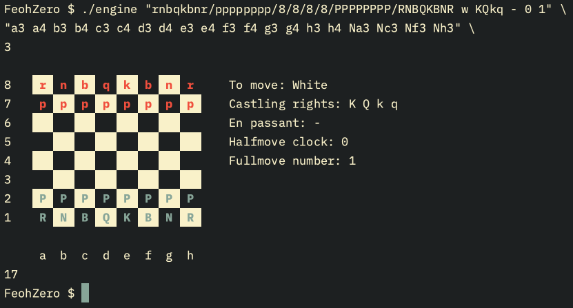

# Description

FeohZero is a simple [Chess Engine](https://en.wikipedia.org/wiki/Chess_engine) written in C. Its usage is quite simple. The main program (engine.c) takes 3 arguments. These are: The [FEN](https://en.wikipedia.org/wiki/Forsyth%E2%80%93Edwards_Notation)
that describes the chess position, a list of the moves that the engine is allowed to play, as well as an integer value that indicates the maximum thinking time of the engine. If the program is used with correct arguments, it will print a single integer: The index that
corresponds to the move the engine chose out of the list (Indexing starts at 0) and it will terminate with exit code `0`. If the correct arguments arent given, instructions for its usage is given, and it returns with exit code `1`. Should it fail for any other reason,
it will again exit with exit code `1`.



# Features

Some basic features of the engine are:
- Bitboards & Magic Bitboards
- Material & Piece-Square Table Evaluation
- King Safety & Pawn structure evaluation
- Iterative Deepening Search
- AB-Pruning
- Move Ordering & PV-Node
- Transposition Table
- Successful Perft Tests

Note: Details on the implementation of the engine are included in the `docs` folder in an organized manner.

# Project installation

## Docker setup
Build and run the development environment container, by running the command:
```sh
$ docker compose up -d --build
```
You should now be able to interact with your engine on http://0.0.0.0:8000/.

Now, if you want to recompile the sources, just firstly attach to the project's
running container:
```sh
$ docker exec -it feoh bash
```
and then run the commands:
```sh
$ make engine
```
if you want to build the c program, or:
```sh
$ make web/engine.wasm
```
if you want to build the web assembly program (also consider refreshing the browser).

Lastly, run:
``` sh
$ docker compose down
```
to just shut down the container.

## Manual setup (Linux or MacOS)

Firstly, if you want to build the C program, run:
```sh
$ make engine
```

If you want to run the server, compile the webassembly target (requires the [emscripten compiler](https://emscripten.org/docs/getting_started/downloads.html#sdk-download-and-install])), and then run:

```sh
$ make WEB_TARGET=web/engine.wasm web/engine.wasm
```

## Extra Makefile commands

In order to run the Perft tests run:
``` sh
$ make test
```

To clean up project's build files run:
``` sh
$ make clean
```

Finally, run the server (requires python3):

```sh
$ make run
python3 -m http.server --directory web
Serving HTTP on 0.0.0.0 port 8000 (http://0.0.0.0:8000/) ...
```

You should now be able to interact with your engine on http://0.0.0.0:8000/.


